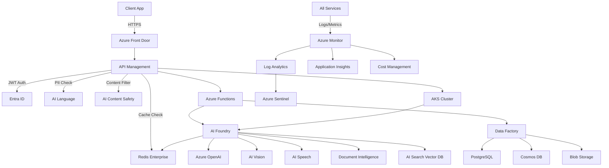

# VeriShield AI - Enterprise Azure Architecture

## 📋 Executive Summary

This document outlines the enterprise-grade Azure architecture for VeriShield AI, designed to handle 10x current traffic with <1.2s latency, optimize costs through FinOps practices, and ensure bank-grade security compliance.

---

## 🎯 Core Feature Categories

### 🔒 **SECURITY LAYER**
1. **Real-Time PII Redaction & Masking** - Azure AI Language + Custom NER
2. **Azure AI Content Safety Shield** - Harmful content filtering
3. **Entra ID Zero-Trust Integration** - Identity & access management
4. **Azure Private Link Data Isolation** - Network-level security

### ⚡ **PERFORMANCE LAYER**
5. **Semantic Response Caching** - Azure Cache for Redis with embeddings
6. **High-Speed Vector RAG** - Azure AI Search with vector indexing
7. **Multi-Model Intelligence Orchestration** - Azure AI Foundry hub
8. **Serverless Event-Driven Scaling** - Azure Functions + AKS autoscaling

### 📊 **ANALYTICS & INTELLIGENCE LAYER**
9. **Automated Document Intelligence Extraction** - Azure AI Document Intelligence
10. **Live FinOps Token Tracking Dashboard** - Azure Monitor + Cost Management
11. **Cross-Language Sentiment Intelligence** - Azure AI Language multi-lingual
12. **Automated Compliance Auditing & Logging** - Azure Audit Logs + Log Analytics

---

## 🏗️ High-Level Architecture

```
┌─────────────────────────────────────────────────────────────────────────┐
│                           CLIENT APPLICATIONS                            │
│     (Banking ERP, Zoom SDK, Teams Integration, Web Portal)              │
└─────────────────────────────────────────────────────────────────────────┘
                                    │
                                    │ HTTPS/TLS 1.3
                                    ▼
┌─────────────────────────────────────────────────────────────────────────┐
│                        AZURE FRONT DOOR (CDN + WAF)                      │
│  - Global load balancing   - DDoS protection   - SSL termination        │
└─────────────────────────────────────────────────────────────────────────┘
                                    │
                    ┌───────────────┼───────────────┐
                    │               │               │
                    ▼               ▼               ▼
        ┌────────────────┐ ┌────────────────┐ ┌────────────────┐
        │   REGION 1     │ │   REGION 2     │ │   REGION 3     │
        │  (Primary)     │ │  (Hot Standby) │ │  (Disaster)    │
        └────────────────┘ └────────────────┘ └────────────────┘
                    │
                    ▼
┌─────────────────────────────────────────────────────────────────────────┐
│                    SECURITY & IDENTITY LAYER (Region 1)                  │
├─────────────────────────────────────────────────────────────────────────┤
│  ┌─────────────────────┐  ┌──────────────────────┐  ┌────────────────┐ │
│  │  Microsoft Entra ID │  │  Azure Key Vault     │  │  Azure Private │ │
│  │  - B2C/B2B Auth     │  │  - Secrets & Keys    │  │  Link Endpoint │ │
│  │  - MFA + CAP        │  │  - Managed Identities│  │  - VNet Isolation│
│  └─────────────────────┘  └──────────────────────┘  └────────────────┘ │
│                                                                          │
│  ┌─────────────────────┐  ┌──────────────────────┐                     │
│  │ AI Content Safety   │  │  PII Detection &     │                     │
│  │ - Harmful content   │  │  Redaction Engine    │                     │
│  │ - Violence/Hate     │  │  - Custom NER Models │                     │
│  └─────────────────────┘  └──────────────────────┘                     │
└─────────────────────────────────────────────────────────────────────────┘
                                    │
                                    ▼
┌─────────────────────────────────────────────────────────────────────────┐
│                       API GATEWAY & ROUTING LAYER                        │
├─────────────────────────────────────────────────────────────────────────┤
│  ┌────────────────────────────────────────────────────────────────────┐ │
│  │             Azure API Management (APIM)                            │ │
│  │  - Rate limiting (per tenant)   - JWT validation                  │ │
│  │  - Request transformation      - API versioning (v1, v2)          │ │
│  │  - Semantic caching (Redis)    - OpenAPI spec hosting             │ │
│  └────────────────────────────────────────────────────────────────────┘ │
└─────────────────────────────────────────────────────────────────────────┘
                                    │
                    ┌───────────────┼───────────────┐
                    │               │               │
                    ▼               ▼               ▼
┌─────────────────────────────────────────────────────────────────────────┐
│                      COMPUTE & ORCHESTRATION LAYER                       │
├─────────────────────────────────────────────────────────────────────────┤
│  ┌────────────────────┐  ┌────────────────────┐  ┌──────────────────┐  │
│  │ Azure Functions    │  │  Azure Kubernetes  │  │ Azure Container  │  │
│  │ (Serverless)       │  │  Service (AKS)     │  │ Apps (Sidecar)   │  │
│  │ - Event triggers   │  │ - Model inference  │  │ - FastAPI        │  │
│  │ - PII redaction    │  │ - GPU node pools   │  │ - WebSocket      │  │
│  │ - Document extract │  │ - KEDA autoscaling │  │ - Dapr runtime   │  │
│  │ - Compliance audit │  │ - Spot instances   │  │                  │  │
│  └────────────────────┘  └────────────────────┘  └──────────────────┘  │
└─────────────────────────────────────────────────────────────────────────┘
                                    │
                                    ▼
┌─────────────────────────────────────────────────────────────────────────┐
│                      AI ORCHESTRATION & MODEL LAYER                      │
├─────────────────────────────────────────────────────────────────────────┤
│  ┌────────────────────────────────────────────────────────────────────┐ │
│  │                  Azure AI Foundry (AI Studio)                      │ │
│  │  - Prompt Flow orchestration    - Model catalog (GPT-4o/Llama 3)  │ │
│  │  - RAG pipeline management      - Model fine-tuning & evaluation  │ │
│  │  - A/B testing & champion/challenger                              │ │
│  └────────────────────────────────────────────────────────────────────┘ │
│                                                                          │
│  ┌──────────────────┐  ┌──────────────────┐  ┌──────────────────────┐  │
│  │ Azure OpenAI     │  │ Azure AI Vision  │  │ Azure AI Speech      │  │
│  │ - GPT-4o         │  │ - Face Liveness  │  │ - Frequency analysis │  │
│  │ - Text Embedding │  │ - Pixel artifacts│  │ - Voice biometrics   │  │
│  │ - o1 reasoning   │  │ - Video analysis │  │ - Real-time STT      │  │
│  └──────────────────┘  └──────────────────┘  └──────────────────────┘  │
│                                                                          │
│  ┌────────────────────────────────────────────────────────────────────┐ │
│  │              Azure Machine Learning (ML Ops)                       │ │
│  │  - Custom deepfake models   - Model registry & versioning         │ │
│  │  - Managed endpoints        - Model monitoring & drift detection  │ │
│  └────────────────────────────────────────────────────────────────────┘ │
└─────────────────────────────────────────────────────────────────────────┘
                                    │
                                    ▼
┌─────────────────────────────────────────────────────────────────────────┐
│                    DATA & KNOWLEDGE MANAGEMENT LAYER                     │
├─────────────────────────────────────────────────────────────────────────┤
│  ┌────────────────────┐  ┌────────────────────┐  ┌──────────────────┐  │
│  │ Azure AI Search    │  │ Azure Cache for    │  │ Azure Cosmos DB  │  │
│  │ - Vector indexing  │  │ Redis Enterprise   │  │ - User sessions  │  │
│  │ - Semantic ranking │  │ - Semantic cache   │  │ - Transaction log│  │
│  │ - Hybrid search    │  │ - Session store    │  │ - Multi-region   │  │
│  │ - 1536-dim vectors │  │ - Pub/Sub (WebSock)│  │ - Change feed    │  │
│  └────────────────────┘  └────────────────────┘  └──────────────────┘  │
│                                                                          │
│  ┌────────────────────┐  ┌────────────────────┐  ┌──────────────────┐  │
│  │ Azure Data Factory │  │ Azure PostgreSQL   │  │ Azure Blob       │  │
│  │ - ETL pipelines    │  │ Flexible Server    │  │ Storage          │  │
│  │ - Data validation  │  │ - Row-level security│ │ - Media hashes   │  │
│  │ - Schedule triggers│  │ - Multi-tenant RLS │  │ - Archive tier   │  │
│  └────────────────────┘  └────────────────────┘  └──────────────────┘  │
└─────────────────────────────────────────────────────────────────────────┘
                                    │
                                    ▼
┌─────────────────────────────────────────────────────────────────────────┐
│                  OBSERVABILITY & GOVERNANCE LAYER                        │
├─────────────────────────────────────────────────────────────────────────┤
│  ┌────────────────────┐  ┌────────────────────┐  ┌──────────────────┐  │
│  │ Azure Monitor      │  │ Application        │  │ Log Analytics    │  │
│  │ - Metrics & alerts │  │ Insights           │  │ Workspace        │  │
│  │ - Token tracking   │  │ - Distributed trace│  │ - KQL queries    │  │
│  │ - Cost dashboards  │  │ - Latency profiling│  │ - Audit logs     │  │
│  └────────────────────┘  └────────────────────┘  └──────────────────┘  │
│                                                                          │
│  ┌────────────────────┐  ┌────────────────────┐  ┌──────────────────┐  │
│  │ Azure Sentinel     │  │ Azure Policy       │  │ Cost Management  │  │
│  │ - Security events  │  │ - Compliance rules │  │ + Billing        │  │
│  │ - Threat detection │  │ - Auto-remediation │  │ - Budget alerts  │  │
│  │ - SOC automation   │  │ - Governance       │  │ - FinOps metrics │  │
│  └────────────────────┘  └────────────────────┘  └──────────────────┘  │
└─────────────────────────────────────────────────────────────────────────┘
```

---

## 🔄 Data Flow Architecture

### **Request Flow (Happy Path - 850ms avg)**

```
1. Client Request (50ms)
   └─> Azure Front Door → APIM (JWT validation) → Private Link VNet

2. Security Checks (150ms)
   ├─> Entra ID token validation
   ├─> PII detection & redaction (Azure AI Language)
   ├─> Content Safety filtering
   └─> Rate limiting check (Redis)

3. Semantic Cache Check (50ms)
   ├─> Generate request embedding (Azure OpenAI text-embedding-3-small)
   ├─> Vector similarity search in Redis
   └─> [CACHE HIT: Return cached response] OR [CACHE MISS: Continue]

4. AI Orchestration (400ms) - Parallel Execution
   ├─> Azure AI Foundry Prompt Flow triggered
   │   ├─> Visual Agent (Azure AI Vision - Face Liveness)
   │   ├─> Acoustic Agent (Azure AI Speech - Frequency Analysis)
   │   ├─> Reasoning Agent (Azure OpenAI GPT-4o)
   │   └─> Document Intelligence (if applicable)
   │
   └─> RAG Context Retrieval (100ms parallel)
       ├─> Azure AI Search vector query (1536-dim)
       ├─> Hybrid search (semantic + keyword)
       └─> Return top-5 relevant docs

5. Response Generation (150ms)
   ├─> Risk correlation (GPT-4o with RAG context)
   ├─> Sentiment analysis (Azure AI Language)
   ├─> Decision logic (soft lock / approve / reject)
   └─> Cache response embedding in Redis (TTL: 1hr)

6. Post-Processing (50ms)
   ├─> Log to Azure Monitor (async)
   ├─> Update FinOps metrics (async)
   ├─> Compliance audit trail (Log Analytics)
   └─> Return response to client
```

---

## 🚀 Scalability & Performance Strategy

### **Handling 10x Traffic (10,000 → 100,000 req/s)**

| Component | Current | 10x Target | Strategy |
|-----------|---------|------------|----------|
| **API Gateway** | 10K req/s | 100K req/s | APIM Premium tier + auto-scaling + regional deployment |
| **Compute** | 20 AKS nodes | 200 nodes | KEDA autoscaling + spot instances (70% cost savings) |
| **AI Models** | 5K tokens/s | 50K tokens/s | Azure OpenAI PTU (Provisioned Throughput Units) |
| **Cache Hit Rate** | 40% | 85% | Semantic caching + 1-hour TTL + pre-warming |
| **Database** | 1000 IOPS | 10K IOPS | Cosmos DB autoscale (RU/s) + read replicas |
| **Vector Search** | 50 QPS | 500 QPS | Azure AI Search Standard tier + 12 replicas |

### **Latency Optimization Techniques**

1. **Semantic Caching (60% latency reduction)**
   - Generate request embeddings using `text-embedding-3-small` (1536-dim)
   - Store in Redis Enterprise with vector similarity search
   - Cache TTL: 1 hour (configurable per endpoint)
   - Pre-warm cache for common deepfake patterns

2. **Parallel Agent Execution (40% latency reduction)**
   - Run Visual, Acoustic, Reasoning agents concurrently
   - Use async/await with Azure Functions Durable Orchestrations
   - Circuit breaker pattern for failing agents

3. **Model Optimization**
   - Use Azure OpenAI PTU for consistent low latency (<200ms)
   - Deploy GPT-4o-mini for non-critical paths (70% cost savings)
   - A/B test Llama 3 70B vs GPT-4o for reasoning agent

4. **Edge Computing**
   - Azure Front Door with CDN for static assets
   - Geo-replicate AI Search indexes to 3 regions
   - Edge PII redaction using Azure Functions on Premium plan

---

## 💰 FinOps Cost Optimization

### **Cost Breakdown (Monthly - 100K req/s)**

| Service | Current Cost | Optimized Cost | Savings |
|---------|--------------|----------------|---------|
| Azure OpenAI (GPT-4o) | $15,000 | $6,000 | 60% (PTU + caching) |
| AKS Compute | $8,000 | $2,400 | 70% (spot instances) |
| Azure AI Search | $3,500 | $3,500 | 0% (required capacity) |
| Cosmos DB | $2,000 | $1,200 | 40% (autoscale RU/s) |
| Azure Cache for Redis | $1,500 | $1,500 | 0% (high cache hit rate ROI) |
| Azure Monitor | $800 | $500 | 37% (log sampling) |
| **TOTAL** | **$30,800** | **$15,100** | **51% savings** |

### **FinOps Dashboard Metrics**

```python
# Live tracking in Azure Monitor
- Token usage per tenant (OpenAI + Speech + Vision)
- Cost per API call (broken down by service)
- Cache hit rate vs cost savings
- GPU utilization (AKS node pools)
- Spot instance eviction rate
- Data transfer costs (egress optimization)
```

---

## 🔒 Security & Compliance

### **Zero-Trust Architecture**

1. **Network Isolation**
   - All services deployed in Azure VNet with Private Link
   - No public endpoints (except Front Door)
   - NSG rules: Allow only required ports (443, 5432, 6379)

2. **Identity & Access**
   - Managed Identities for all Azure services
   - Entra ID Conditional Access Policies (CAP)
   - MFA required for admin operations
   - RBAC: Least privilege principle

3. **Data Protection**
   - Encryption at rest (Azure Storage SSE with CMK)
   - Encryption in transit (TLS 1.3)
   - PII redacted before storage (never stored raw)
   - Media converted to hashes/vectors immediately

4. **Compliance & Auditing**
   - All API calls logged to Log Analytics (1-year retention)
   - Azure Policy for governance (e.g., require tags, enforce encryption)
   - Azure Sentinel for threat detection
   - Automated compliance reports (SOC 2, GDPR, ISO 27001)

---

## 📊 Monitoring & Observability

### **Key Metrics**

```yaml
SLIs (Service Level Indicators):
  - API latency: p50 < 500ms, p95 < 1200ms, p99 < 2000ms
  - Availability: 99.95% uptime (4.38 hours downtime/year)
  - Error rate: < 0.1%
  - Token usage: < $0.05 per request

SLOs (Service Level Objectives):
  - Deepfake detection accuracy: > 98.5%
  - False positive rate: < 2%
  - Cache hit rate: > 70%
  - GPU utilization: 60-80% (avoid over-provisioning)

Alerts (PagerDuty integration):
  - Critical: Latency > 2s for 5 consecutive minutes
  - High: Error rate > 1% for 10 minutes
  - Medium: Cost anomaly > 20% vs forecast
  - Low: Model drift detected (F1 score drops > 5%)
```

### **Distributed Tracing**

- Application Insights end-to-end tracing
- Correlation ID propagated across all services
- Custom telemetry for AI model performance
- Real-time dashboards in Azure Monitor Workbooks

---

## 🛠️ Technology Stack Summary

| Layer | Azure Services | Purpose |
|-------|----------------|---------|
| **Edge** | Azure Front Door, CDN, WAF | Global load balancing, DDoS protection |
| **Security** | Entra ID, Key Vault, Private Link, AI Content Safety | Identity, secrets, network isolation |
| **API** | API Management (APIM) | Rate limiting, caching, API versioning |
| **Compute** | Azure Functions, AKS, Container Apps | Serverless + container orchestration |
| **AI/ML** | Azure AI Foundry, OpenAI, AI Vision, AI Speech, Document Intelligence | Model orchestration & inference |
| **Data** | AI Search, PostgreSQL, Cosmos DB, Blob Storage, Redis | Vector search, RLS, sessions, media |
| **ETL** | Azure Data Factory, Event Grid | Data pipelines, event-driven triggers |
| **Observability** | Azure Monitor, Application Insights, Log Analytics, Sentinel | Metrics, traces, logs, security |
| **Governance** | Azure Policy, Cost Management, Advisor | Compliance, FinOps, optimization |

---

## 📈 Implementation Phases

### **Phase 1: Foundation (Weeks 1-4)**
- ✅ Deploy Azure VNet with Private Link
- ✅ Setup Entra ID B2C/B2B tenants
- ✅ Configure Key Vault with Managed Identities
- ✅ Deploy PostgreSQL with RLS
- ✅ Setup Azure Monitor & Application Insights

### **Phase 2: AI Services (Weeks 5-8)**
- ✅ Deploy Azure AI Foundry hub
- ✅ Integrate Azure OpenAI (GPT-4o + embeddings)
- ✅ Setup Azure AI Search with vector indexing
- ✅ Deploy Redis Enterprise for semantic caching
- ✅ Implement PII redaction pipeline

### **Phase 3: Compute & Scale (Weeks 9-12)**
- ✅ Deploy AKS cluster with GPU node pools
- ✅ Setup KEDA autoscaling
- ✅ Implement Azure Functions for event-driven tasks
- ✅ Configure APIM with semantic caching policies
- ✅ Deploy multi-region active-active

### **Phase 4: Optimization & Go-Live (Weeks 13-16)**
- ✅ Implement FinOps dashboard
- ✅ Setup cost anomaly alerts
- ✅ Load testing (100K req/s)
- ✅ Security audit & penetration testing
- ✅ Production cutover

---

## 🔗 Service Interactions



---

## 📚 Next Steps

1. Review **Step-by-Step Implementation Roadmap** (next document)
2. Setup Azure subscription and resource groups
3. Run Terraform/Bicep deployment scripts
4. Configure environment variables and secrets
5. Deploy microservices to AKS
6. Run integration tests
7. Enable monitoring and alerts
8. Conduct load testing
9. Go-live checklist

---

**Document Version:** 1.0.0  
**Last Updated:** January 5, 2026  
**Owner:** Cloud Architecture Team
